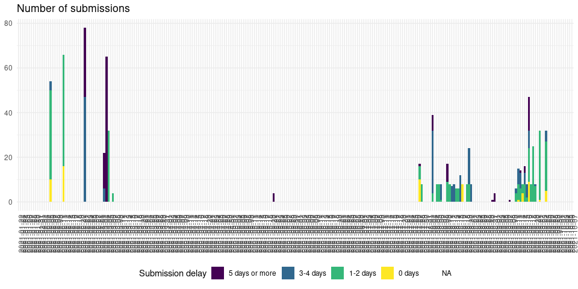
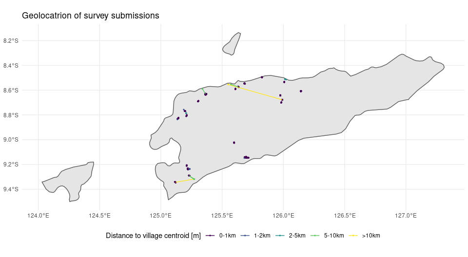
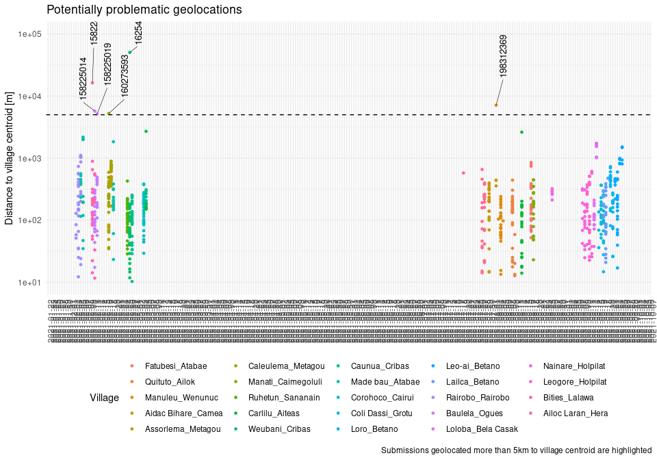

Validation exploration
================

-   **Author**: Fernando Cagua
-   **Last updated**: 2021-06-19

The purpose of this document is to monitor the quality of the data
collected. To explore the submissions data and metadata to assert

## Survey numbers

<!-- -->

## Survey submissions

<!-- -->

## Geolocation

<!-- -->

<!-- -->
